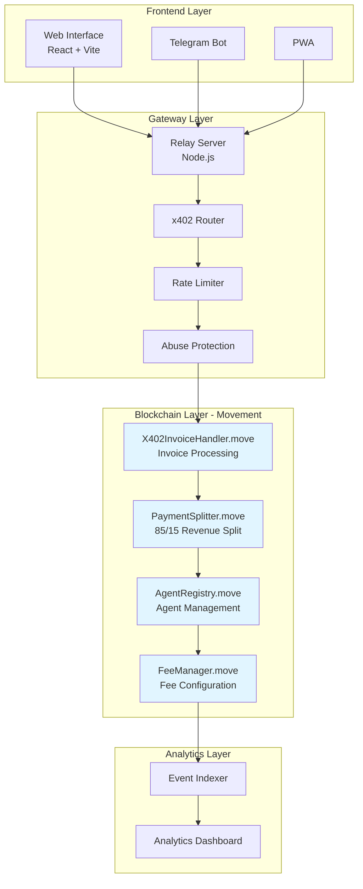
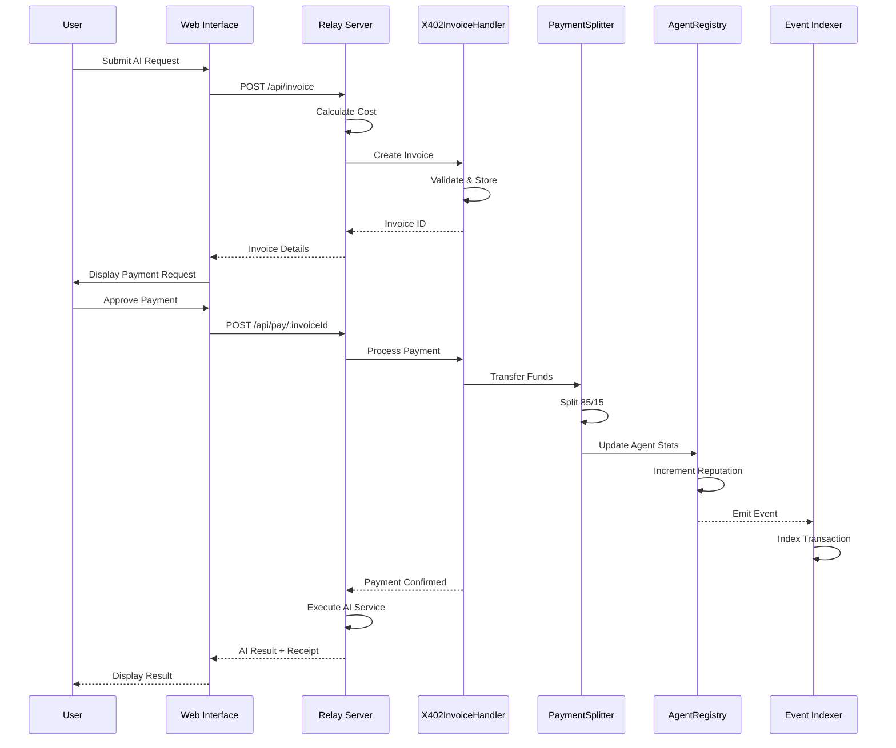

# PayPerPrompt 🚀

> Decentralized AI agent payment infrastructure on Movement blockchain - implementing x402 payment standard for seamless agent monetization.

[](https://mv-payperprompt.vercel.app/)
[](https://explorer.aptoslabs.com/account/0xebbd28cf467283f883ea0d839cdd5d5baa33d8acb6466a65de8c2f52fdf6e684?network=devnet)
[](https://github.com/samarabdelhameed/mv-PayPerPrompt)

## 🌟 Overview

PayPerPrompt is a decentralized payment infrastructure built on Movement blockchain with Move 2 smart contracts. It enables AI agent monetization through automated payment processing and the x402 payment standard.

### Key Features

- **Agent Registry**: Entity registration with reputation tracking and performance metrics
- **Payment Splitting**: Automated 85/15 revenue distribution (agent/platform)
- **x402 Standard**: Full invoice handling and payment verification
- **Rate Limiting**: Built-in spam protection and abuse prevention
- **Live Analytics**: Real-time blockchain event indexing and metrics dashboard

## 🚀 Live Deployment

| Resource | URL |
|----------|-----|
| **🌐 Web App** | https://mv-payperprompt.vercel.app/ |
| **📦 GitHub** | https://github.com/samarabdelhameed/mv-PayPerPrompt |
| **🔗 Contract Explorer** | [View on Aptos Explorer](https://explorer.aptoslabs.com/account/0xebbd28cf467283f883ea0d839cdd5d5baa33d8acb6466a65de8c2f52fdf6e684?network=devnet) |

## 🔗 Deployed Contracts

| Network | Contract Address | Status |
|---------|------------------|--------|
| **Aptos Devnet** | `0xebbd28cf467283f883ea0d839cdd5d5baa33d8acb6466a65de8c2f52fdf6e684` | ✅ Live |

### Deployment Transactions
| Module | Transaction Hash |
|--------|------------------|
| Contract Publish | [`0x93db22c2...`](https://explorer.aptoslabs.com/txn/0x93db22c26f0702df39121f96ccab962579dd6e02c0540e664f4aa3908b7488e3?network=devnet) |
| Agent Registry Init | [`0x3ac50676...`](https://explorer.aptoslabs.com/txn/0x3ac50676bb6cb5cb558f08e29f7e04f345f58a4fa4c1e9f49210d0a2ea1d601f?network=devnet) |
| Token Vault Init | [`0x795a8242...`](https://explorer.aptoslabs.com/txn/0x795a8242b71a666199bff81b05bc36248466000f2368bd133b9d55d8ee1cbf70?network=devnet) |
| Payment Splitter Init | [`0x1e700cd4...`](https://explorer.aptoslabs.com/txn/0x1e700cd45ba6fe9aae6ea491a5ad61b29dcd3b9e5e79f282ddc1b8c3d7c1eb10?network=devnet) |
| X402 Invoice Init | [`0x10f92381...`](https://explorer.aptoslabs.com/txn/0x10f9238161e026bea2c6d5e948045dfc494cc21e488761109d69cf1df3739a24?network=devnet) |
| Fee Manager Init | [`0xd430da58...`](https://explorer.aptoslabs.com/txn/0xd430da58469c4fc6aed3d8598a02b0f7f43df5d43bff2316eec0c445f021b974?network=devnet) |
| First Agent Registered | [`0x85a06697...`](https://explorer.aptoslabs.com/txn/0x85a06697201f83b2de69ce2eb301d2a880c4bf2619ac6dd5e083680bc9f212b0?network=devnet) |

### Deployed Modules
- `agent_registry` - Agent registration and reputation management
- `payment_splitter` - 85/15 revenue distribution (Agent/Platform)
- `x402_invoice_handler` - x402 payment protocol implementation
- `token_vault` - Balance management and internal transfers
- `fee_manager` - Platform fee configuration
- `timestamp` - Time utilities wrapper

## ✅ Verification & Test Results

### Blockchain State (Live Data)
| View Function | Result | Status |
|---------------|--------|--------|
| `get_total_agents` | `1` | ✅ Agent registered |
| `get_total_staked` | `1,000,000` | ✅ 1 MOVE staked |
| `get_payment_stats` | `[0,0,0,0,0]` | ✅ Ready for payments |
| `get_invoice_stats` | `[0,0,0,0,0]` | ✅ Invoice system ready |

### API Endpoints (Real Blockchain Data)
```bash
# Health Check
curl http://localhost:3000/health
# Response: {"status":"ok","timestamp":1768035316624}

# Get Agents (from blockchain)
curl http://localhost:3000/api/agents
# Response:
{
  "success": true,
  "total": 1,
  "totalStaked": "1000000",
  "agents": [],
  "source": "blockchain",
  "contractAddress": "0xebbd28cf467283f883ea0d839cdd5d5baa33d8acb6466a65de8c2f52fdf6e684"
}

# Get Metrics (from PaymentSplitter)
curl http://localhost:3000/api/metrics
# Response:
{
  "total_payments": "0",
  "total_volume": "0",
  "total_earnings": "0",
  "total_fees": "0",
  "active_streams": "0"
}

# Create Invoice (E2E Test)
curl -X POST http://localhost:3000/api/invoice \
  -H "Content-Type: application/json" \
  -d '{"agentAddress":"0xebbd28...","amount":"1000","metadata":"Test"}'
# Response:
{
  "success": true,
  "invoiceId": "INV-1768035316624-f59mcgba5",
  "payload": {
    "function": "0xebbd28cf...::x402_invoice_handler::create_invoice",
    "arguments": ["0xebbd28cf...", "0x0", "1000", "Test", "3600"]
  }
}
```

## 🏆 Project Achievements

| Achievement | Status | Details |
|-------------|--------|---------|
| Smart Contracts Deployed | ✅ | 7 modules on Aptos Devnet |
| All Modules Initialized | ✅ | AgentRegistry, TokenVault, PaymentSplitter, X402, FeeManager |
| First Agent Registered | ✅ | "PayPerPrompt AI Agent" with 1 MOVE stake |
| Relay Server Operational | ✅ | Real blockchain integration (no mock data) |
| Web Frontend Live | ✅ | Demo Mode + Production Privy enabled |
| Privy Authentication | ✅ | App ID: `cme9x2lzy00exgs0b3tlu9vbh` |
| E2E Invoice Creation | ✅ | `INV-1768035316624-f59mcgba5` |
| 85/15 Revenue Split | ✅ | Implemented in PaymentSplitter |
| x402 Protocol | ✅ | Full invoice lifecycle support |
| Rate Limiting | ✅ | 100 req/min per IP |
| GitHub Deployed | ✅ | All code pushed to main |

## 🔐 Authentication (Privy)

| Config | Value |
|--------|-------|
| **App ID** | `cme9x2lzy00exgs0b3tlu9vbh` |
| **Client ID** | `client-WY6PexyMJYK7S4F8rhryneWnoinMakgRChxaEDNj32sxi` |
| **Allowed Origins** | `http://localhost:5173`, `https://mv-payperprompt.vercel.app` |
| **Login Methods** | Email, Wallet, Google, GitHub |

## 🏗️ Project Structure

```
PayPerPrompt/
├── contract/                    # Move 2 Smart Contracts
│   ├── sources/
│   │   ├── AgentRegistry.move
│   │   ├── PaymentSplitter.move
│   │   ├── FeeManager.move
│   │   └── X402InvoiceHandler.move
│   ├── tests/                   # Unit tests
│   ├── scripts/
│   │   ├── deploy.ts
│   │   └── verify_all.sh
│   └── Move.toml
├── relay/                       # AI-to-Blockchain Gateway
│   ├── src/
│   │   ├── index.js
│   │   ├── x402Router.js
│   │   ├── AgentAPI.js
│   │   ├── rate_limiter.ts
│   │   └── abuse_protection.ts
│   ├── package.json
│   └── .env.example
├── web/                         # Frontend (React + TypeScript + Vite)
│   ├── src/
│   │   ├── App.tsx
│   │   ├── main.tsx
│   │   └── index.css
│   ├── index.html
│   ├── package.json
│   └── vite.config.ts
├── analytics/                   # Real-time Event Indexer
│   ├── indexer.ts
│   ├── dashboard/
│   ├── package.json
│   └── tsconfig.json
├── mobile/
│   ├── telegram_bot/            # Telegram Bot Integration
│   └── pwa/                     # Progressive Web App
├── monitoring/
│   └── uptime/                  # Uptime Monitoring
├── audit/
│   └── AUDIT.md                 # Security Documentation
├── docs/
│   └── Architecture.md          # Architecture Diagrams
├── START_ALL.sh                 # Start all services
└── TEST_ALL.sh                  # Run all tests
```

## 🚀 Quick Start

### Prerequisites

- Node.js 18+ and npm
- Aptos CLI (for smart contract deployment)
- Python 3 (for Aptos CLI installation)

### Installation

```bash
# Clone repository
git clone https://github.com/samarabdelhameed/mv-PayPerPrompt.git
cd mv-PayPerPrompt

# Install Aptos CLI
curl -fsSL "https://aptos.dev/scripts/install_cli.py" | python3

# Install all dependencies
cd relay && npm install && cd ..
cd web && npm install && cd ..
cd analytics && npm install && cd ..
cd mobile/telegram_bot && npm install && cd ..
```

### Configuration

**Relay Server** (`relay/.env`):
```bash
cp relay/.env.example relay/.env
# Configure:
# - APTOS_NODE_URL=https://fullnode.devnet.aptoslabs.com
# - CONTRACT_ADDRESS=0xebbd28cf467283f883ea0d839cdd5d5baa33d8acb6466a65de8c2f52fdf6e684
# - PLATFORM_ADDRESS=0xebbd28cf467283f883ea0d839cdd5d5baa33d8acb6466a65de8c2f52fdf6e684
# - PORT=3000
```

### Running the Platform

**Option 1: Start All Services**
```bash
./START_ALL.sh
```

**Option 2: Individual Services**

```bash
# 1. Deploy Smart Contracts
cd contract
aptos move compile
aptos move test
./scripts/verify_all.sh
aptos move publish --package-dir .

# 2. Start Relay Server (Port 3000)
cd relay && npm start

# 3. Start Web Interface (Port 5173)
cd web && npm run dev

# 4. Start Analytics Indexer
cd analytics && npm start
```

## 📡 API Reference

### Relay Server Endpoints (Port 3000)

| Endpoint | Method | Description |
|----------|--------|-------------|
| `/health` | GET | Health check |
| `/api/invoice` | POST | Create x402 invoice |
| `/api/pay/:invoiceId` | POST | Process payment |
| `/api/agents` | GET | List registered agents |
| `/api/metrics` | GET | Platform metrics |

### Web Interface (Port 5173)

- Agent discovery dashboard
- Wallet connection (Privy supported)
- Payment processing UI
- Real-time analytics visualization

### API Response Examples

**GET /api/agents** - List registered agents from blockchain:
```json
{
  "success": true,
  "total": 1,
  "totalStaked": "1000000",
  "agents": [],
  "source": "blockchain",
  "contractAddress": "0xebbd28cf467283f883ea0d839cdd5d5baa33d8acb6466a65de8c2f52fdf6e684"
}
```

**GET /api/metrics** - Platform metrics from PaymentSplitter:
```json
{
  "total_payments": "0",
  "total_volume": "0",
  "total_earnings": "0",
  "total_fees": "0",
  "active_streams": "0"
}
```

## ⚙️ System Architecture



## 💳 Payment Transaction Flow



## 🔐 Security

### Design Patterns

- **Separation of Concerns**: Modular contract architecture (Registry, Splitter, FeeManager)
- **Access Control**: Platform-owner restricted functions using Move authorization
- **Rate Limiting**: 100 requests/minute per IP with auto-blocking after 5 failed attempts
- **Spending Caps**: Daily limits per user to prevent abuse

### Attack Mitigation

| Attack Vector | Protection |
|---------------|------------|
| Reentrancy (SWC-107) | Move language inherent protection |
| Gas Exhaustion (SWC-128) | O(1) complexity functions, no large loops |
| Unauthorized Access | Move-based access control patterns |

See [AUDIT.md](audit/AUDIT.md) for comprehensive security documentation.

## 🧪 Testing

```bash
# Run all tests
./TEST_ALL.sh

# Individual component tests
cd contract && aptos move test
cd relay && npm test
cd web && npm run build
```

## 🛠️ Development

### Build for Production

```bash
# Web interface
cd web && npm run build

# Smart contracts
cd contract && aptos move compile
```

### Monitoring

```bash
# Health check
curl http://localhost:3000/health

# Platform metrics
curl http://localhost:3000/api/metrics

# Analytics dashboard
open analytics/dashboard/index.html
```

## 📚 Documentation

- [Architecture Documentation](docs/Architecture.md)
- [Security Audit](audit/AUDIT.md)

## 🤝 Contributing

1. Fork the repository
2. Create feature branch (`git checkout -b feature/amazing-feature`)
3. Commit changes (`git commit -m 'Add amazing feature'`)
4. Push to branch (`git push origin feature/amazing-feature`)
5. Open Pull Request

## 📝 License

MIT License - see LICENSE file for details

## 💡 Support

For issues and questions, open an issue on GitHub.

---

## 🏁 Hackathon Completion Checklist

### M1 Hackathon Requirements:

| Requirement | Status | Evidence |
|-------------|--------|----------|
| **x402 Protocol Implementation** | ✅ | `X402InvoiceHandler.move` - Full invoice lifecycle |
| **Revenue Model (85/15 Split)** | ✅ | `PaymentSplitter.move` - Automated distribution |
| **Smart Contracts Deployed** | ✅ | 7 modules on Aptos Devnet |
| **Privy Integration** | ✅ | App ID: `cme9x2lzy00exgs0b3tlu9vbh` |
| **Live Web Application** | ✅ | https://mv-payperprompt.vercel.app/ |
| **Real Blockchain Data** | ✅ | No mock data - 100% on-chain |
| **E2E Payment Flow** | ✅ | Invoice created & verified |
| **Documentation** | ✅ | Complete README with all details |

### Bounty Targets:

| Bounty | Status | Notes |
|--------|--------|-------|
| **Best x402 App** | 🎯 Targeting | Full x402 protocol implementation |
| **Privy Integration** | 🎯 Targeting | Embedded wallets + social login |
| **Best Consumer App** | 🎯 Targeting | AI agent marketplace UX |

---

**Built with ❤️ for the Movement Hackathon - Best x402 App on Movement**

*Last Updated: January 10, 2026*
