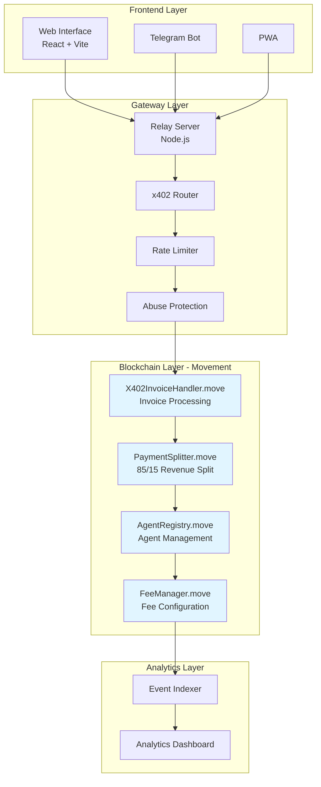
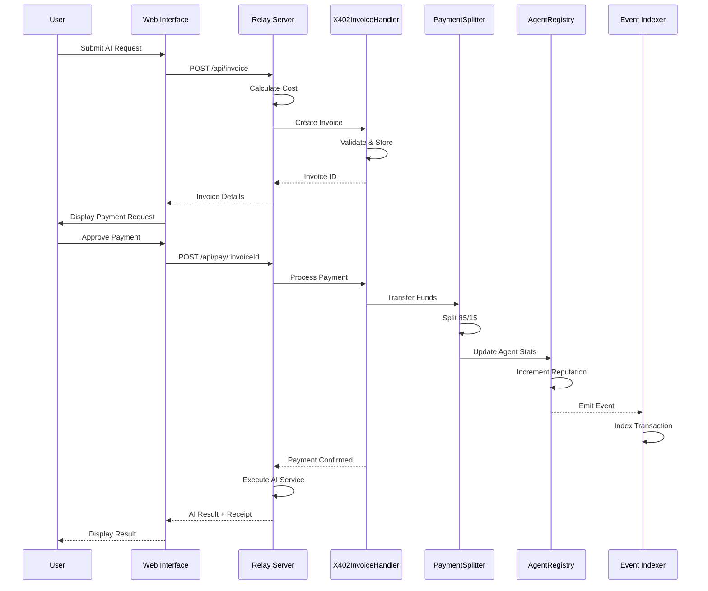

# PayPerPrompt

> Decentralized AI agent payment infrastructure on Movement blockchain - implementing x402 payment standard for seamless agent monetization.

## 🌟 Overview

PayPerPrompt is a decentralized payment infrastructure built on Movement blockchain with Move 2 smart contracts. It enables AI agent monetization through automated payment processing and the x402 payment standard.

### Key Features

- **Agent Registry**: Entity registration with reputation tracking and performance metrics
- **Payment Splitting**: Automated 85/15 revenue distribution (agent/platform)
- **x402 Standard**: Full invoice handling and payment verification
- **Rate Limiting**: Built-in spam protection and abuse prevention
- **Live Analytics**: Real-time blockchain event indexing and metrics dashboard

## 🏗️ Project Structure

```
PayPerPrompt/
├── contract/                    # Move 2 Smart Contracts
│   ├── sources/
│   │   ├── AgentRegistry.move
│   │   ├── PaymentSplitter.move
│   │   ├── FeeManager.move
│   │   └── X402InvoiceHandler.move
│   ├── tests/                   # Unit tests
│   ├── scripts/
│   │   ├── deploy.ts
│   │   └── verify_all.sh
│   └── Move.toml
├── relay/                       # AI-to-Blockchain Gateway
│   ├── src/
│   │   ├── index.js
│   │   ├── x402Router.js
│   │   ├── AgentAPI.js
│   │   ├── rate_limiter.ts
│   │   └── abuse_protection.ts
│   ├── package.json
│   └── .env.example
├── web/                         # Frontend (React + TypeScript + Vite)
│   ├── src/
│   │   ├── App.tsx
│   │   ├── main.tsx
│   │   └── index.css
│   ├── index.html
│   ├── package.json
│   └── vite.config.ts
├── analytics/                   # Real-time Event Indexer
│   ├── indexer.ts
│   ├── dashboard/
│   ├── package.json
│   └── tsconfig.json
├── mobile/
│   ├── telegram_bot/            # Telegram Bot Integration
│   └── pwa/                     # Progressive Web App
├── monitoring/
│   └── uptime/                  # Uptime Monitoring
├── audit/
│   └── AUDIT.md                 # Security Documentation
├── docs/
│   └── Architecture.md          # Architecture Diagrams
├── START_ALL.sh                 # Start all services
└── TEST_ALL.sh                  # Run all tests
```

## 🚀 Quick Start

### Prerequisites

- Node.js 18+ and npm
- Aptos CLI (for smart contract deployment)
- Python 3 (for Aptos CLI installation)

### Installation

```bash
# Clone repository
git clone <repository-url>
cd PayPerPrompt

# Install Aptos CLI
curl -fsSL "https://aptos.dev/scripts/install_cli.py" | python3

# Install all dependencies
cd relay && npm install && cd ..
cd web && npm install && cd ..
cd analytics && npm install && cd ..
cd mobile/telegram_bot && npm install && cd ..
```

### Configuration

**Relay Server** (`relay/.env`):
```bash
cp relay/.env.example relay/.env
# Configure:
# - APTOS_NODE_URL=https://fullnode.devnet.aptoslabs.com
# - CONTRACT_ADDRESS=0x1
# - PLATFORM_ADDRESS=0x2
# - PORT=3000
```

### Running the Platform

**Option 1: Start All Services**
```bash
./START_ALL.sh
```

**Option 2: Individual Services**

```bash
# 1. Deploy Smart Contracts
cd contract
aptos move compile
aptos move test
./scripts/verify_all.sh
aptos move publish --package-dir .

# 2. Start Relay Server (Port 3000)
cd relay && npm start

# 3. Start Web Interface (Port 5173)
cd web && npm run dev

# 4. Start Analytics Indexer
cd analytics && npm start
```

## 📡 API Reference

### Relay Server Endpoints (Port 3000)

| Endpoint | Method | Description |
|----------|--------|-------------|
| `/health` | GET | Health check |
| `/api/invoice` | POST | Create x402 invoice |
| `/api/pay/:invoiceId` | POST | Process payment |
| `/api/agents` | GET | List registered agents |
| `/api/metrics` | GET | Platform metrics |

### Web Interface (Port 5173)

- Agent discovery dashboard
- Aptos wallet connection
- Payment processing UI
- Real-time analytics visualization

## ⚙️ System Architecture



## 💳 Payment Transaction Flow



## 🔐 Security

### Design Patterns

- **Separation of Concerns**: Modular contract architecture (Registry, Splitter, FeeManager)
- **Access Control**: Platform-owner restricted functions using Move authorization
- **Rate Limiting**: 100 requests/minute per IP with auto-blocking after 5 failed attempts
- **Spending Caps**: Daily limits per user to prevent abuse

### Attack Mitigation

| Attack Vector | Protection |
|---------------|------------|
| Reentrancy (SWC-107) | Move language inherent protection |
| Gas Exhaustion (SWC-128) | O(1) complexity functions, no large loops |
| Unauthorized Access | Move-based access control patterns |

See [AUDIT.md](audit/AUDIT.md) for comprehensive security documentation.

## 🧪 Testing

```bash
# Run all tests
./TEST_ALL.sh

# Individual component tests
cd contract && aptos move test
cd relay && npm test
cd web && npm run build
```

## 🛠️ Development

### Build for Production

```bash
# Web interface
cd web && npm run build

# Smart contracts
cd contract && aptos move compile
```

### Monitoring

```bash
# Health check
curl http://localhost:3000/health

# Platform metrics
curl http://localhost:3000/api/metrics

# Analytics dashboard
open analytics/dashboard/index.html
```

## 📚 Documentation

- [Architecture Documentation](docs/Architecture.md)
- [Security Audit](audit/AUDIT.md)

## 🤝 Contributing

1. Fork the repository
2. Create feature branch (`git checkout -b feature/amazing-feature`)
3. Commit changes (`git commit -m 'Add amazing feature'`)
4. Push to branch (`git push origin feature/amazing-feature`)
5. Open Pull Request

## 📝 License

MIT License - see LICENSE file for details

## 💡 Support

For issues and questions, open an issue on GitHub.

---

**Built with ❤️ for the decentralized AI economy**
