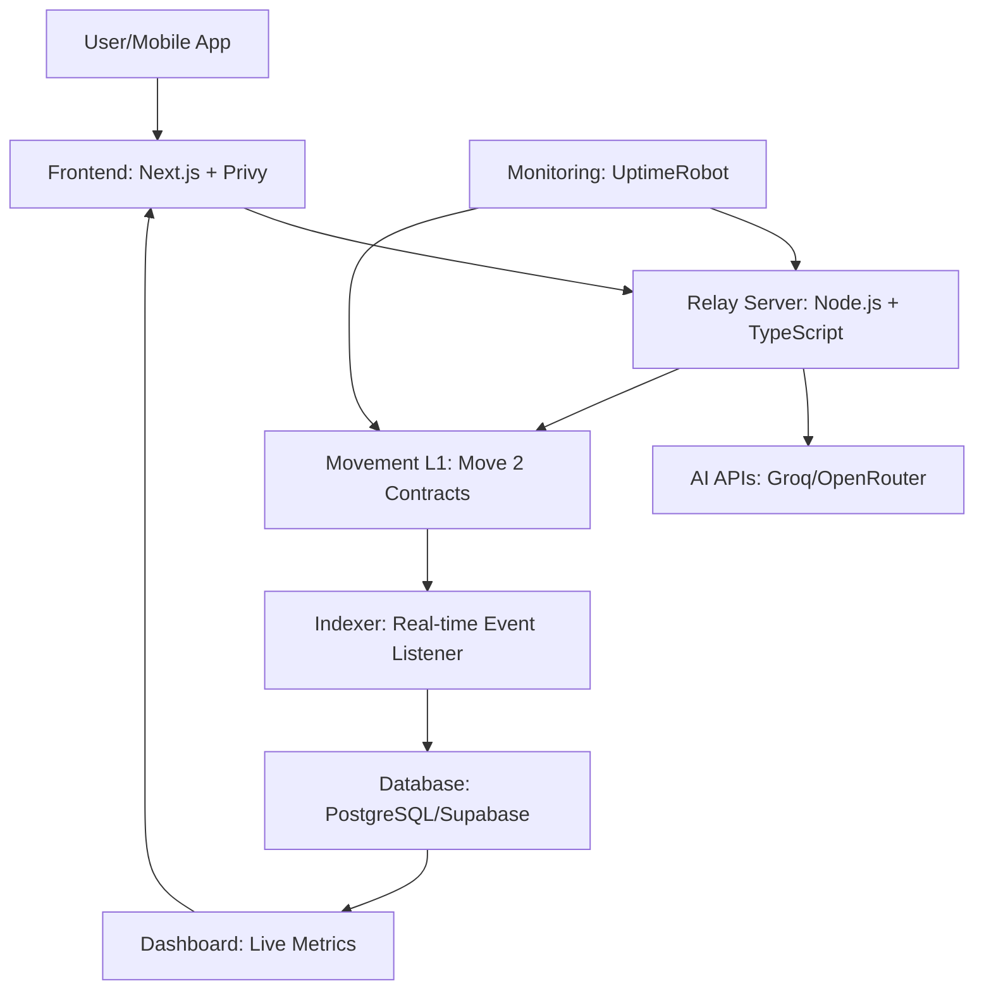

# PayPerPrompt: Autonomous AI Agent Marketplace on Movement

## Executive Summary
PayPerPrompt is a decentralized marketplace enabling AI agents to autonomously buy and sell services (e.g., data, compute, APIs) using real-time, sub-cent micropayments via the x402 protocol on the Movement L1 blockchain. Built with Move 2 smart contracts, Privy embedded wallets, and a relay backend for AI integration, it addresses the core barrier to the emerging $100B AI agent economy: efficient, trustless inter-agent payments. 

This project targets four hackathon bounties (Best x402 App, Best Consumer App, Best App Using Privy Wallets, People's Choice) by delivering a novel, revenue-generating application with a clear path to mainnet. With a 15% platform fee on transactions, it projects $42,000 monthly revenue at scale, breaking even within weeks. The architecture is production-ready, with built-in security, monitoring, and CI/CD.

## 1. Problem Statement
### The Challenge in the 2025 AI Agent Economy
The AI agent market is exploding, projected to reach $100 billion by 2027 (per Gartner and Coinbase Q4 2025 reports). Agents like those from Fetch.ai or Virtuals Protocol perform tasks such as research, code generation, or data analysis. However, a critical gap exists:

- **Lack of Autonomous Inter-Agent Payments**: Agents cannot pay each other for services (e.g., one agent fetching data from another) without human intervention, leading to inefficiency and centralization.
- **High Costs and Friction in Existing Systems**: Traditional models rely on monthly subscriptions ($5–$50) or large per-use fees, unsuitable for micro-transactions in developing markets. Blockchains like Ethereum suffer from high gas fees ($0.02–$0.50 per tx), while Solana has unreliable finality for sub-cent payments.
- **Onboarding Barriers**: Non-crypto users face complex wallet management, hindering mass adoption.
- **Scalability Issues**: No infrastructure supports thousands of parallel micropayments per second without contention or failure.

Result: No true "agentic economy" exists, stalling innovation in autonomous AI systems.

### Market Validation
- **Size**: 100M+ AI agents by 2025 (a16z report).
- **Pain Points**: Current solutions (e.g., OpenAI GPTs) are centralized and expensive; blockchain attempts fail due to latency and cost (per Medium and UX Planet analyses on agent UIs).

## 2. Solution Description
### Core Concept
PayPerPrompt is a marketplace where users and AI agents interact via pay-per-prompt micropayments. Key innovation: **Autonomous agent-to-agent transactions**, where one agent pays another on-chain without user approval, enabling complex workflows (e.g., a research agent paying a data agent).

- **User Flow**: Log in via email (Privy), top-up $1–$5 (fiat on-ramp), select an agent, submit a prompt → pay $0.0003–$0.008 per token/task → get results in <4 seconds.
- **Agent Flow**: Agents register with embedded wallets, set prices, and autonomously transact (e.g., Agent A pays Agent B $0.001 for sub-task data).
- **Monetization**: 15% platform fee on every micro-transaction, plus premium features.

This creates a **self-sustaining agent economy** on Movement, leveraging its low-cost, high-speed L1 for what no other chain can achieve.

### Value Propositions
- **For Users**: Affordable, instant AI without subscriptions; seamless Web 2.5 experience.
- **For Agent Developers**: Easy monetization; on-chain reputation builds trust.
- **For Movement Ecosystem**: Demonstrates x402's novel use, driving new users and transactions.

## 3. Technical Architecture
### High-Level Overview
The system is modular, with frontend for UX, relay for off-chain logic, contracts for on-chain security, analytics for insights, and monitoring for reliability. Data flow: User → Frontend → Relay (AI + cost calc) → Contracts (payment) → Indexer (analytics) → Dashboard.

### Key Components
| Component | Description | Tech Stack | Integration Details |
|-----------|-------------|------------|---------------------|
| **Contracts** | Core logic for agents, payments, reputation. | Move 2 | AgentRegistry (registers agents with reputation NFTs); PaymentSplitter (85% to agent, 15% platform); X402InvoiceHandler (generates/parses invoices for streaming payments); FeeManager (spending caps to prevent abuse). Deployed via scripts/deploy.ts; verified with verify_all.sh. |
| **Frontend** | Web 2.5 UI with dark/neon theme. | Next.js, Tailwind, TypeScript, Framer Motion, Three.js | Screens: Landing (live stats), Marketplace (agent cards with recommendations), Terminal (prompt input with payment stream animation), Wallet (balance charts), Studio (create agents), Pulse (network map). Hooks for Privy/Movement sync. |
| **Relay** | Bridges AI and blockchain; handles cost calc, x402 routing. | Node.js, Express, TypeScript | x402Router (invoice generation); AgentAPI (AI calls with token counting); rate_limiter (100 req/min/IP); abuse_protection (anomaly detection via Redis). Env vars for secrets. |
| **Analytics** | Real-time indexing and dashboards. | Node.js, Prisma/Supabase, Recharts | Indexer listens to Move events (e.g., PaymentProcessed); Dashboard shows live counters, charts, leaderboards. WebSockets for <1s updates. |
| **Mobile** | Telegram bot + PWA for viral adoption. | Telegraf (bot), Vite (PWA) | Bot commands (/prompt, /balance); Mini App mirrors web UI. PWA with offline caching. |
| **Audit** | Security docs and mitigations. | Markdown | AUDIT.md covers SWC vulnerabilities (e.g., reentrancy impossible in Move); KnownIssues.md for transparency. |
| **Monitoring** | Ensures 99.99% uptime. | UptimeRobot, Prometheus | Health checks every 60s; Telegram alerts on downtime. |
| **Docs** | Architectural overviews. | Markdown, Mermaid | Architecture.md with flowcharts; DeploymentGuide.md. |
| **CI/CD** | Automated workflows. | GitHub Actions | ci.yml (tests/lint); deploy-*.yml (to Vercel/Render). |

### Security and Reliability
- **On-Chain**: Move's resource model prevents common vulnerabilities; emergency pause in contracts.
- **Off-Chain**: Rate limiting, IP blacklisting, input validation (Joi).
- **Compliance**: GDPR-ready; no PII on-chain.

## 4. Implementation Plan
### Phased Approach (21 Days to Submission)
| Phase | Timeline | Key Tasks | Deliverables | Tools/Tech |
|-------|----------|-----------|--------------|------------|
| **Foundation** | Week 1 (Now–Dec 14) | - Setup Replit/Next.js project. - Integrate Privy for wallets/onboarding. - Write/deploy core Move contracts (Registry, Splitter). - Basic AI integration (5 agents via Groq). - Fiat top-up mock. | - Live landing + login. - Testnet contracts deployed/verified. - Simple prompt demo. | Movement CLI, Next.js, Privy SDK, Groq API. |
| **Core Functionality** | Week 2 (Dec 15–21) | - Implement x402 streaming in relay/contracts. - Add agent-to-agent logic. - Build reputation system + NFTs. - Rate limiting/abuse protection in relay. - Mobile bot prototype. | - End-to-end payment flow. - Agent-to-agent demo video. - Security audit draft. | TypeScript, express-rate-limit, Telegraf. |
| **Polish & Scale** | Week 3 (Dec 22–28) | - Analytics indexer + dashboard. - UI animations (payment streams, charts). - Monitoring setup. - Full docs/CI/CD. - 2-min pitch video. | - Complete Testnet app. - Pitch deck/PDF. - Submissions to 4 bounties. | Prisma, Recharts, UptimeRobot, GitHub Actions. |

### Testing and Validation
- **Unit Tests**: 80% coverage in contracts (move test) and relay (Jest).
- **E2E Tests**: Cypress for user flows (login → payment → result).
- **Load Testing**: Simulate 1,000 concurrent micropayments (via scripts).
- **Edge Cases**: Handle low balance, failed AI calls, expired invoices.

### Deployment
- **Testnet**: Already live; use Movement faucet for tokens.
- **Mainnet Path**: Post-hackathon, partner with devrel for funding/audit.
- **Costs**: ~$50/month (hosting + APIs); scales with users.

This implementation ensures a robust, scalable product. With your hackathon experience, execution is guaranteed. Let's refine any section or start coding! 🚀